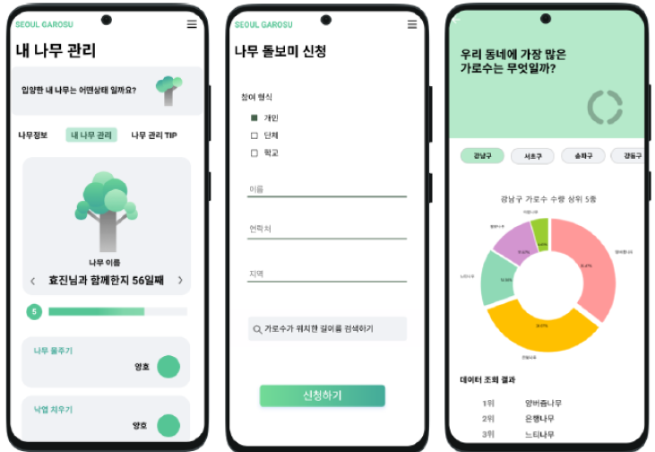
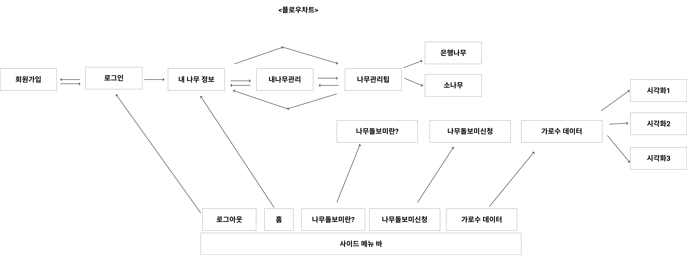

# SEOUL GAROSU

## 서비스 개요

나무 돌보미 사업 활성화를 위한 나만의 가로수 입양/관리 앱입니다.

## 사용 기술

### Front-end

- Android Studio
- React

### Back-end

- Firebase

### Collaboration

- Github, Notion, Figma

## 서비스 플로우 차트

## 기여한 부분

- 나무돌보미 신청 페이지 제작
- 나무 돌보미 사업 설명 및 나무 돌보기 팁 페이지 제작
- 데이터 시각화 페이지 제작

## 수상

공공데이터 해커톤 서비스 개발 부문 대상 수상

## 기술적으로 어려웠던 점

- 팀의 주제상 웹보다는 앱으로 구현하는 것이 더 낫다고 판단되었습니다. 따라서 개발에 기여하기 위해 리액트를 이용해 필요한 페이지를 개발,배포하고 웹뷰를 이용해 안드로이드 앱에 링크를 넣기로 하였습니다.

- 나무 돌보미 신청 페이지를 제작하며 유저 정보는 앱에 있고 서버에 신청하는 로직은 웹에 있었습니다. 따라서 유저 정보를 웹으로 전달하는 과정이 필요했습니다. 안드로이드 스튜디오의 CookieManager을 통해 신청페이지에 유저 정보가 담긴 쿠키를 세팅함으로써 이 문제를 해결하였습니다.

- 공공데이터를 이용해 현재 존재하고 있는 가로수 정보를 지도api에 마커표시를 해야 했는데 공공데이터 요청 프로토콜이 http를 사용하고 있었습니다. 따라서 firebase function을 이용하여 서버에서 데이터를 요청하고 그것을 브라우저에서 요청하는 방식으로 문제를 해결하였습니다.
